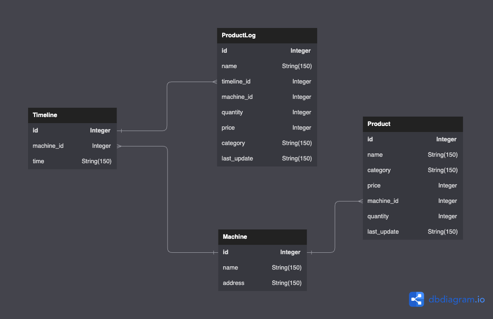

[](https://sonarcloud.io/summary/new_code?id=Salagoza_vending-machine)  [](https://sonarcloud.io/summary/new_code?id=Salagoza_vending-machine)  [](https://sonarcloud.io/summary/new_code?id=Salagoza_vending-machine)

# Vending Machine

Vending Machine Tracking Application to manage all the vending machine in MUIC using Flask framework.

## Installation

Install Poetry

```
poetry install
```
Running Test
```
poetry run pytest
```
Run the project
```
poetry run flask run
```

## Documentation

Visit the API documentation for all the APIs in this project using this path after running the project.
```
http://localhost:<port>/api/swagger/  
```

## ER-Diagram



